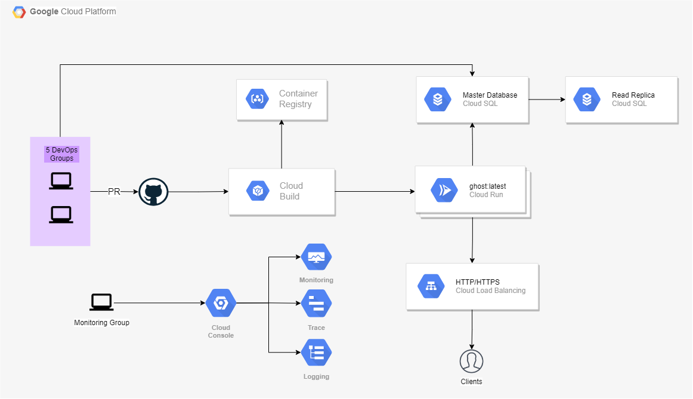

# ghost-demo

This repo holds the files needed to deploy Ghost automatically.  
The Ghost version used is 3.42 from the Docker Hub Page -> https://hub.docker.com/_/ghost/  
The automated deployment is achieved by using a bash script to enable all the deependencies needed in the GCP Project and the main Infrastructure is deployed using Terraform.  
The Pipelines run in Cloud Build, this is why there will be no need to install Terraform locally.  

## Assumptions
- The changes done to the application at code base should only be deployed through the pipeline.
- No manual changes to the infrastructure, should be reflected in Terraform code

## Architecture



## Requirements
- Google Cloud SDK
- Google Cloud Project
- Google Login within SDK and configuration to Project 
- GitHub Account ( 2 Repositories )

## Procedure
Once the requirements mentioned above are met, the repositories can be linked to the GCP Project.   
Connect both Terraform and CI/CD repos -> https://console.cloud.google.com/cloud-build/repos?  

### Clone the repository  
```
git clone https://github.com/antoniocauk/ghost-demo-terraform.git
```


### Assign ENV variables (Needed for bootstrap)
```
export REPO_NAME=<Name of Terraform GitHub Repo> - (E.g. ghost-demo-terraform)  
export REPO_OWNER=<Name of Repo Owner> - (E.g. antoniocauk)  
export BRANCH_PATTERN=<Pattern of branch> - (E.g. ^main$)  
```

### Run Bootstrap
Run "bootstrap.sh" to create the terraform service account and its JSON key. Enable Terraform required APIs and create Terraform triggers.   
```
chmod +x ./bootstrap.sh
./bootstrap.sh
```

### Run Terraform
The Terraform Cloud Build triggers can be found in the Triggers page -> https://console.cloud.google.com/cloud-build/triggers?  
Change the Destroy trigger to be manually triggered (Manual Invocation).  

The Terraform code will create the following resources:
- Networks and Subnetworks
- Cloud SQL
- Secret Manager and Secrets
- Ghost Image in GCR
- Cloud Run
- Load Balancer
- Cloud Build Triggers


### Push code into your own repo
Change the terraform.auto.tfvars values to fit your environment (project_id is the most important).
Once the changes are done, push the code into your repository

## CI/CD
To implement the CI/CD follow the steps here -> https://github.com/antoniocauk/ghost-demo-cicd


## Extra Info
Sensitive data is saved in Secret Manager with default values, this data can be altered to fit your environment.


### Helpful commands to run the code locally 
While trying out the application and checking the different types of deployments I found these commands to be helpful:  
- Build image locally and push it to Google Container Registry
```
gcloud builds submit --config cloudbuild.yaml .
```  

- Run Docker container locally and connect to external MySQL instance
```
docker build -t ghost --build-arg DB_HOST=$DB_HOST --build-arg DB_PORT=$DB_PORT --build-arg DB_USER=$DB_USER --build-arg DB_PASS=$DB_PASS --build-arg DB_NAME=$DB_NAME .  
```